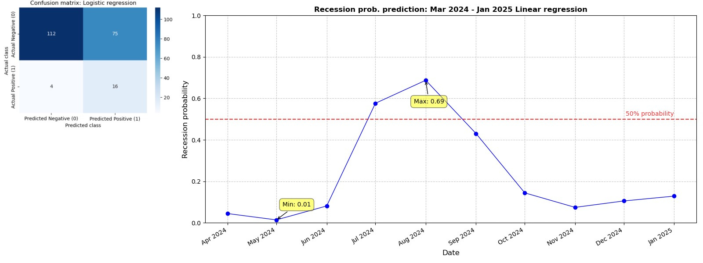

# Predicting US recession probabilities using Machine learning models

## Overview

This project aims to explore and predict the likelihood of a recession in the United States by leveraging a comprehensive dataset of key economic indicators. 

The project was inspired by recent discussions within economic communities and social media platforms, particularly Reddit, where concerns about unemployment, economic slowdown, and potential recession were widely debated during 2024. These discussions were further fueled by reports suggesting that the U.S. might already be experiencing a “hidden recession.” (remember "Sahm's rule" that was the buzz recently?) Well. this raised curiosity about -- whether it is possible with the available economic data gather/generate insights or predict the probability of a recession in the near future. 

**Disclaimer:** of course I know it is very hard (if possible at all), since the recession are very rare events (and that is a major pain for ML) and are very different by nature. The most recent one was caused by "black swan" -- pandemy, the one before that -- by real estates market bubble (although some were able to predict that one), and before that was recession caused by dotcom crisis, oil market crisis and so on. But it was interesting to combine dataset and apply some techniques and see what level of precision can be achieved.

## Purpose

The primary objective of this project is to combine historical economic data from various reputable sources, build machine learning models, and assess their performance in predicting the likelihood of a U.S. recession over the next 10 months. By analyzing key economic indicators and employing advanced modeling techniques, the project aims to quantify recession risks and evaluate the accuracy of different models.

## Data collection

The dataset for this project spans from 1948 to 2024 and combines a variety of economic indicators from multiple reliable sources such as the Bureau of Census, the Federal Reserve, and the World Trade Organization (WTO). However, gathering and processing the data presented several challenges, as the data was often provided in different formats and sometimes contradictory across sources. These issues required extensive data cleaning, validation, and harmonization to ensure consistency. Key challenges included:

-	Inconsistent formats: data from different sources, such as CSV files, PDFs, and web-based tables, were not always structured uniformly. This required significant effort to standardize formats and ensure compatibility for analysis.
-	Conflicting data: in some cases, data from one official source would not match the figures provided by another source, even when referring to the same economic indicator. These discrepancies had to be resolved through cross-referencing and, where possible, using the most credible or comprehensive dataset.
-	Missing data: for certain periods, particularly in older datasets, data was missing or incomplete. In these instances, indirect methods, such as interpolation and estimation from related indicators, were used to infer the missing values, ensuring the dataset maintained continuity across the entire time range.
-	Data cleaning: extensive preprocessing was necessary to handle outliers, smooth noisy data, and fill in missing values where appropriate. This process also involved aligning timeframes and adjusting for seasonality and inflation in some of the economic indicators.

### Key indicators collected include:

- GDP: real GDP and real GDP growth rate, sourced from the Federal Reserve Economic Data. 
  - real GDP (https://fred.stlouisfed.org/series/GDPC1)
  - real GDP rate (https://fred.stlouisfed.org/series/A191RL1Q225SBEA)
- Recession dates: obtained from FRED.
  - https://fred.stlouisfed.org/series/USREC
- Unemployment rates: data from the Bureau of Labor statistics.
  - https://data.bls.gov/pdq/SurveyOutputServlet
- Industrial production: sourced from the Federal Reserve’s Industrial Production and Capacity Utilization reports.
  - https://www.federalreserve.gov/releases/g17/current/default.htm
- Stock market data: Dow Jones Industrial and S&P500 performance from S&P Global.
  - https://www.spglobal.com/spdji/en/web-data-downloads/reports/dja-performance-report-daily.xls%3Fforce_download%3Dtrue&ved=2ahUKEwjYyZTEp9KHAxVaBDQIHS1pDXU4ChAWegQICBAB&usg=AOvVaw0HHk557jTY0ImxjKP4DqAc
- Yield curve data: 3-month Treasury bill yield data from FRED.
  - https://fred.stlouisfed.org/series/TB3MS
- Housing market data: housing starts and house price indices from the U.S. Census Bureau and Shiller data (Irrational Exuberance, by R. Shiller).
  - https://fred.stlouisfed.org/series/HOUSTNF
  - http://demographia.com/db-hstarts.pdf
  - https://www.census.gov/construction/nrc/historical_data/index.html
  - https://www.census.gov/construction/nrc/data/series.html
  - https://shillerdata.com
  - https://fred.stlouisfed.org/series/USSTHPI
  - https://observationsandnotes.blogspot.com/2011/06/us-housing-prices-since-1900.html
- Credit data: consumer loans and real estate loan data from FRED.
  - https://fred.stlouisfed.org/series/CONSUMER
  - https://fred.stlouisfed.org/series/CONSUMERNSA
  - https://fred.stlouisfed.org/series/REALLNNSA
- Consumer price Index (CPI) and Inflation rates: data on CPI and historical inflation rates from FRED and rate inflation.
  - https://fred.stlouisfed.org/series/CPIAUCSL
  - https://www.usinflationcalculator.com/inflation/consumer-price-index-and-annual-percent-changes-from-1913-to-2008/
  - https://www.rateinflation.com/inflation-rate/usa-historical-inflation-rate/
- Global economic data: data on global trade and economic conditions sourced from the WTO.
  - https://www.wto.org/english/res_e/statis_e/trade_evolution_e/evolution_trade_wto_e.htm

Of course there can be added more inicators and I'm working on that.

## Methodology

The project applies a combination of time-series analysis and machine learning to model and predict recession probabilities. 

Initially, a Vector Auto-regression (VAR) model was used to generate reliable data forecasts for the period between March 2024 and January 2025. Indicators such as unemployment rates and inflation showed a close match between predicted and actual data, validating the accuracy of the VAR model.

The next step involved using the forecasted data as input to predict the probability of a recession in the next 10 months, utilizing the following machine learning models:

- Logistic regression: this model was used as a baseline model to establish performance benchmarks.
- Random Forest classifier: implemented to improve precision and recall, particularly for predicting recession periods.
- XGBoost: applied to further enhance model accuracy and improve recession detection using resampling techniques like SMOTE.
- Support Vector Machines (SVM): explored for their effectiveness in handling complex, non-linear relationships in the data.
- Ensemble techniques: combined various models to improve overall performance and robustness in predicting recessions.

## Metrics and evaluation

To evaluate the performance of the models, several key metrics were employed to capture different aspects of predictive quality:

- Accuracy: measures the overall percentage of correct predictions (both recession, 1, and non-recession, 0).
- Precision: evaluates the proportion of true positive predictions (correctly predicted recessions) relative to all predicted recessions.
- Recall: measures the ability of the model to capture actual recession periods (the proportion of true recessions correctly identified).
- F1-score: the harmonic mean of precision and recall, providing a balanced measure of model performance.
- Area Under the ROC Curve (AUC-ROC): used to evaluate the model’s ability to distinguish between recession and non-recession periods. The AUC score provides insight into how well the model differentiates between classes, with a higher score indicating better performance.

These metrics crucial in comparing the different models, with XGBoost emerging as the best performer (or one of...), achieving an AUC score of 0.912 and an accuracy of 85%, along with a recall of 55% for recession periods, signifying its capability to capture important economic downturns while maintaining high precision for non-recession periods.

## Results and insights

Preliminary results indicate that the Random Forest and XGBoost models perform well in predicting recession probabilities, with the Random Forest model demonstrating strong accuracy for non-recession periods and the XGBoost model offering improved recall for recessions. Feature importance analysis revealed that GDP growth rates, consumer loans, and CPI fluctuations are among the most critical factors influencing recession predictions.

## Roadmap

1.	[Data collection and preprocessing](data_combination.ipynb):
	- Compile historical data from reliable economic sources.
	- Perform feature engineering and clean the dataset to ensure consistency across time periods.
2.	[EDA, time-series forecasting](eda.ipynd):
	- Apply the VAR model to forecast key economic indicators for the next 10 months (April 2024 to Jan 2025).
	- Measure its performance against ARIMA model (on a certain indicators) 
	- Validate the forecasted data against real-world observations.
3.	[Machine learning modeling](modelling.ipynb):
	- Train logistic regression, random forest, XGBoost, and SVM models using the forecasted data.
	- Evaluate models based on precision, recall, F1-score, and accuracy.
	- Utilize cross-validation and AUC-ROC metrics to ensure robustness.
4.	Feature importance and interpretability:
	- Analyze feature importance to identify key economic indicators driving recession predictions.
	- Interpret model predictions in the context of real-world economic conditions.
5.	Final evaluation and predictions:
	- Use ensemble methods to combine model outputs and generate a final prediction for the probability of a U.S. recession.
	- Assess the model’s performance in predicting recession probabilities over the next 10 months.

## Conclusion

This project presents a comprehensive approach to measuring and predicting U.S. recession probabilities using advanced machine learning techniques and a diverse set of economic indicators. The focus was on handling imbalanced data, where recession periods are rarer than non-recession periods, and ensuring that the models are effective at not missing recessions, as predicting a recession incorrectly is less costly than failing to predict an actual recession.

Here is a summary of the performance and insights based on the evaluation metrics and recession probability forecasts for each model and overall conclusion.

**Logistic Regression (LR)**

- Precision (class 1): 0.18
- Recall (class 1): 0.80
- Accuracy: 0.62
- ROC AUC Score: 0.7660
- Confusion Matrix:

The recession probability curve for Logistic Regression is relatively conservative, indicating lower peaks with a maximum probability of 0.69, suggesting that this model is more prone to predicting “no recession” evan in risky situations.
Conclusion: Logistic regression is highly cautious in predicting recessions and tends to favor false positives. But it achieved high recall for recession, making it effective at identifying recession periods, even at the cost of predicting many false positives.

**Random Forest (RF)**

- Precision (class 1): 0.36
- Recall (class 1): 0.65
- Accuracy: 0.86
- ROC AUC Score: 0.8086
- Confusion Matrix:

The predixtion plot shows moderately sharp changes in recession probability, with a maximum of 0.49. The model is a bit more balanced, but it still leans towards over-predicting the non-recession periods.
Conclusion: Random forest provides a better balance between precision and recall compared to Logistic regression, with fewer FPs. However, it's still struggling to fully capture the minority class, missing a few class 1 periods.

**XGBoost (XGB)**

- Precision (class 1): 0.48
- Recall (class 1): 0.70
- Accuracy: 0.90
- ROC AUC Score: 0.8773
- Confusion Matrix:

The XGBoost model forecast shows sharper peaks, with a maximum probability of 0.87, indicating that this model identifies potential recessions with relatively high confidence. It also does a better job of distinguishing between recession and non-recession periods.
Conclusion: XGBoost is one of the top-performing models. Its higher ROC AUC score and balanced performance on precision and recall make it effective for this problem. XGBoost captures both the recession periods and non-recession periods well, with fewer false positives and a higher proportion of true positives.

**Support Vector Machine (SVM)**

- Precision (class 1): 0.21
- Recall (class 1): 0.80
- Accuracy: 0.69
- ROC AUC Score: 0.7655
- Confusion Matrix:

The SVM model forecast demonstrates a sharp spike in recession probability with a max of 0.79, which suggests overconfidence in certain periods. Despite this, the model has some false positives, especially in non-recession periods.
Conclusion: SVM tends to overestimate recession probabilities, leading to more false positives. But its recall for recession periods is high, which makes it less likely to miss a recession. It is useful if the priority is to ensure all potential recessions are captured, even at the expense of some false positives.

**Ensemble voting algorithm**

- Precision (class 1): 0.35
- Recall (class 1): 0.80
- Accuracy: 0.84
- ROC AUC Score: 0.8350
- Confusion Matrix:

The ensemble model shows a smoother curve with a maximum recession probability of 0.59. It balances the risk of false positives with maintaining a reasonable true positive rate, capturing recession signals better than Logistic Regression and SVM.
Conclusion: The ensemble model balances the strengths of all other models, providing relatively high recall without excessively compromising precision. It is highly effective at capturing recession periods while controlling for false positives, making it an excellent choice for recession prediction.

------------------------------
What's interesting: almost all models (except for XGB) capture the same period as the riskiest: July-August. And this aligns well with the talks and news, sentiments that were there in media and social networks -- I think the peak of expectation or fear of a recession being pronounced was just in these months. Another peak is suggested by XGB and "supported" by RF -- October.

- Ok, so what's the **best model**? 
- Well, based on both the metrics and the recession probability forecast plots, XGBoost certainly stands out as the best model. It strikes the optimal balance b/w precision and recall. It has relatively low false positive rate while successfully capturing the recession periods. ROC AUC score of 0.8773 also indicates strong discriminatory power.

- Is Ensemble model a universal soluiton?
- The Ensemble voting classifier indeed provides a robust alternative combining the advantages of each individual model. With high recall and reasonable precision, this model is also a strong candidate if the priority is to maximize recall and reduce the risk of missing a recession.

Given that missing a recession is more pricy than predicting a false positive, models like XGBoost and Ensemble are top choice. Both models ensure that recession periods are captured effectively while keeping FPs to a manageable level. 
What else can be done here: differentiatetd lags. There's are so-called leading and lagging indicators, and mixed too, so they can be treated differently. But this would overcomplicate model, so there would be risk of overfitting. Another improvement coulb be to replace SMOTE with SMOTE-Tomek, maybe it could handle the imbalance problem better. The thirs point of improvement can be to extend the dataset with some other indicators, like AAA corporate bonds, PMI, Manufacturing orders and Consumer and Business sentiments. But still the major problem is the nature of the recessions -- they all are different, they have different origines, and rarity of the events (class 1).
